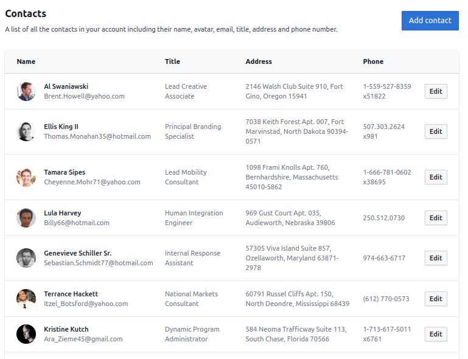

# LANDR Interview Test (Frontend)



## Description

This project implements a single page application that lists a user's contacts. The users are able to create, modify and delete contacts.
Note that this project does not actually make requests to a back-end server to get data. It instead uses a mock API with artificial slowdowns to simulate the behavior of a real server.

## Getting Started

```
git clone REPO_NAME
npm install
npm run dev
```

The website should then be accessible at http://localhost:5137.

## Running tests

Tests are colocated next to the file they test and follow the naming convention `*.test.js`.
To run the tests, run `npm run test`.

## Used libraries

- BlueprintJS as the UI component library
- Tailwindcss for styling components
- @tanstack/react-query for fetching data
- @faker-js/faker to generate fake contacts data
- Formik for forms
- lodash for utility functions
- vitest for unit tests

This project makes heavy use of React Hooks and functional components. Make sure you are familiar with them if you wish to contribute.

## Areas of improvements
- Make it fully responsive by [allowing the columns to stack in the table](https://tailwindui.com/components/application-ui/lists/tables#component-e56f750c63d4e53a24f5f0bf9fd7b52a)
- Add sorting and filtering to the contacts table
- Add a deletion confirmation modal when clicking the "Delete contact" button.
- Make rows expand to show more information about the contact when you click on them
- Split the free-form address input into multiple inputs (street, city, zip code, etc.)
- Use a text-mask to format the phone number input
- Validate the inputs in the mock API with `tiny-invariant`


## Interviewer notes
I did not implement the "select a specific contact and drill down into a more detailed view" as I felt like I have written enough code at this point for the reviewing team to be able to judge my front-end capabilities. I could eventually implement it, if requested.
